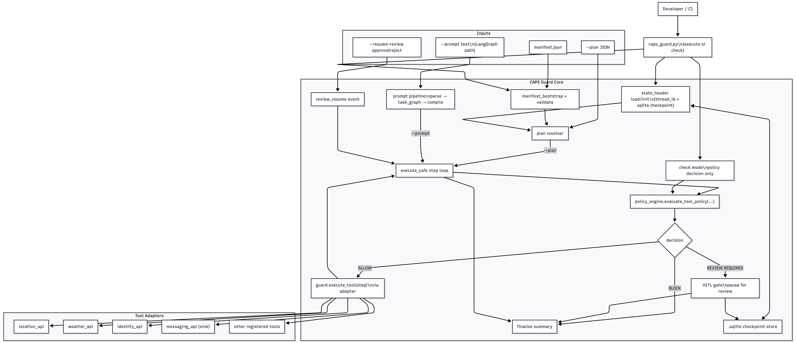
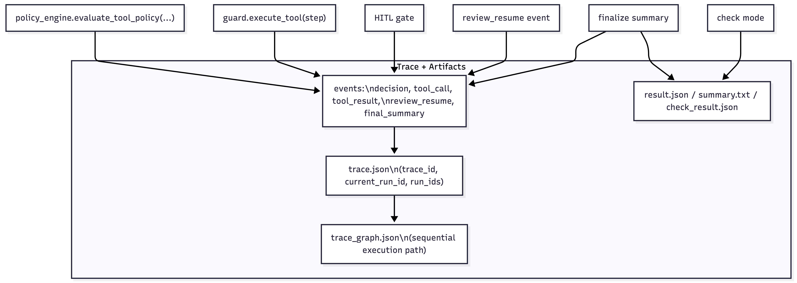

# CAPS Guard

If your team runs LLM or agent workflows that make real-world API calls, CAPS Guard gives you deterministic policy enforcement, human approval gates, and full audit traces at the execution boundary.
CAPS Guard is extracted from CAPS ("Context Action Planning Service"), my broader private project. This repo is the standalone guardrail + audit layer — published as an independent dev tool.

## What Problem It Solves
AI workflows can make side-effect calls (message/email/calendar/etc.) without clear policy visibility.
CAPS Guard enforces deterministic policy decisions at the tool boundary and emits trace artifacts that explain exactly what happened and why.

## Start Here (2-Minute Scan)
- Audience: developers/teams building tool-calling workflows who control the execution boundary.
- Value: deterministic policy decisions (`ALLOW | REVIEW_REQUIRED | BLOCK`), HITL for risky actions, and auditable trace artifacts.
- Adoption model: register tools in manifests and route calls through CAPS adapters or thin wrappers.
- Fastest trial path: run `check` and `execute --plan` first (no Ollama/model needed).
- Prompt flow (`execute --prompt`) needs local Ollama + model.

## Who This Is For / When To Use It
CAPS Guard is for developers building tool-calling AI workflows who want deterministic policy checks, human approval for risky actions, and auditable traces at the execution boundary.
v0.1 works best when your tool/API calls can be routed through CAPS manifests and adapters. It is not yet a drop-in wrapper for every existing agent framework.
Best fit: teams that control their tool execution layer and can integrate at that boundary.

## What This Is / What This Is Not
What this is:
- A guardrail and audit layer for tool-calling AI workflows.
- Deterministic `ALLOW | REVIEW_REQUIRED | BLOCK` decisions.
- Human approval for risky side effects.
- Trace artifacts for execution and review history.

What this is not:
- Not a universal wrapper for every LLM app out of the box.
- Not a full agent framework.
- Not a no-code tool.
- Not a hosted review platform in v0.1.

## Adoption Boundary (How Integration Works)
To use CAPS Guard, your workflow must route tool execution through CAPS Guard’s execution boundary.
In practice, that means:
- Register tools in a manifest.
- Define policy coverage for those tools.
- Use CAPS adapters directly, or wrap existing tool/API calls so CAPS Guard evaluates them before execution.
This is deliberate for v0.1: CAPS Guard is an integration boundary, not a zero-config global wrapper.
If your tool calls are already routed through clean adapter boundaries, integration is usually a few minutes (manifest + one routing point). If tool calls are scattered across your codebase, integrate adapters first.

New tools require two things:
- Manifest coverage: define tool name, side-effect class, sink behavior, and relevant policies.
- Adapter coverage: route the actual tool/API call through CAPS Guard so policy is evaluated before execution.

<details>
  <summary>Implementation Details: before/after adapter wrapping pattern</summary>

  This mirrors the repo's runtime pattern (`core.manifest_loader` + `core.policy_engine` + adapter call), simplified for clarity.

  **Before (direct adapter/API call, no guard):**
  ```python
  from adapters.messaging_api import send_message

  def send_message_tool(message: str):
      params = {"recipient_ref": "Jacob", "message": message}
      request_context = {"thread_id": "demo1"}
      return send_message(params, request_context, trace_id="trace_local")
  ```

  **After (policy-gated at execution boundary):**
  ```python
  from adapters.messaging_api import send_message
  from core.manifest_loader import build_manifest_context, load_manifest
  from core.policy_engine import evaluate_tool_policy

  manifest = load_manifest("src/manifest_demo.json")
  manifest_context = build_manifest_context(manifest)

  def send_message_tool(message: str):
      params = {"recipient_ref": "Jacob", "message": message}
      decision = evaluate_tool_policy(
          step_id="send_message_step",
          tool_name="messaging_api",
          params=params,
          manifest_context=manifest_context,
          approved_for_sink=False,  # switch true on explicit human approval path
          trace_id="trace_local",
      )

      if decision["decision"] == "ALLOW":
          return send_message(params, {"thread_id": "demo1"}, trace_id="trace_local")
      if decision["decision"] == "REVIEW_REQUIRED":
          raise RuntimeError(f"review required: {decision['reason_code']}")
      raise RuntimeError(f"blocked: {decision['reason_code']}")
  ```

  For LangGraph/CrewAI/custom loops, this wrapper belongs in your tool node/executor; no framework rewrite is required.
</details>

## Can I Use This With My Stack?
You can likely use CAPS Guard if:
- Your app/agent makes tool or API calls.
- You control the tool execution layer.
- You can route calls through manifests/adapters or thin wrappers.

You probably cannot use it directly yet if:
- Your stack hides execution in a closed runtime you cannot intercept.
- You want zero integration work.
- You expect automatic support for arbitrary tools without manifest/adapter mapping.

## Install
Core requirements (for `check` and `execute --plan`):
- Python 3.10+

Prompt mode add-ons (for `execute --prompt` only):
- Ollama running locally.
- Pulled local model (default from `src/config.py`).

Setup:
```bash
python3 -m venv .venv
source .venv/bin/activate
pip install -r requirements.txt
```

Docker (optional):
```bash
docker build -t caps-guard:local .
docker run --rm caps-guard:local --help
```

If `docker` is not found on macOS but Docker Desktop is installed:
```bash
export PATH="/Applications/Docker.app/Contents/Resources/bin:$PATH"
hash -r
docker --version
```

## Quickest Path To First Value
Policy check without execution:
```bash
python scripts/caps_guard.py check \
  --manifest src/manifest_demo.json \
  --tool messaging_api \
  --args-json '{"message":"hello"}' \
  --output-dir /tmp/guard_check_demo
```

Plan execution (no prompt parsing needed):
```bash
python scripts/caps_guard.py execute \
  --manifest src/manifest_demo.json \
  --plan examples/plan_rw_demo.json \
  --output-dir /tmp/guard_execute_demo
```

Containerized check demo (no local Python env needed):
```bash
docker run --rm caps-guard:local check \
  --manifest src/manifest_args_demo.json \
  --tool weather_api \
  --args-json '{"query":"drop table users"}' \
  --output-dir /tmp/args_demo_check
```

## Richer End-to-End Prompt Flow (Pause/Resume)
Use this exact v0.1 flow to show pause on sink and explicit approval resume:

```bash
rm -f .caps_guard_demo.sqlite
rm -rf /tmp/section9_block /tmp/section9_approve

python scripts/caps_guard.py execute \
  --manifest src/manifest_demo.json \
  --prompt "If weather is below 100C in Toronto, text Jacob I am not coming to university today." \
  --thread-id demo1 \
  --sqlite-path .caps_guard_demo.sqlite \
  --output-dir /tmp/section9_block \
  > /tmp/section9_block_stdout.json

python scripts/caps_guard.py execute \
  --manifest src/manifest_demo.json \
  --resume-review approve \
  --thread-id demo1 \
  --sqlite-path .caps_guard_demo.sqlite \
  --output-dir /tmp/section9_approve \
  > /tmp/section9_approve_stdout.json
```

Inspect artifacts:
```bash
cat /tmp/section9_block/trace.json
cat /tmp/section9_approve/trace.json
cat /tmp/section9_approve/trace_graph.json

python scripts/caps_guard.py render-trace \
  --trace /tmp/section9_approve/trace.json \
  --output /tmp/section9_approve/trace_render.html \
  --title "CAPS Guard Section9 Trace"
```

Expected behavior:
- First run pauses before sink execution (`pending_review=true`, `paused_for_review=true`).
- Resume run emits `review_resume` and completes sink execution.
- `trace_id` remains stable across pause/resume for the same thread.

## Ollama / LangGraph Notes
- `check` and `execute --plan` paths do not require prompt parsing.
- Prompt-driven execution (`execute --prompt`) uses the LangGraph pipeline and local model/runtime configuration.
- Keep Ollama available when using prompt mode.
- A ready-to-run LangGraph demo is available at `examples/langgraph_demo/README.md`.

## Mini Trace Renderer (v0.1 additive)
Render any `trace.json` artifact into a shareable static HTML timeline:

```bash
python scripts/caps_guard.py render-trace \
  --trace /tmp/section9_approve/trace.json \
  --output /tmp/section9_approve/trace_render.html \
  --title "CAPS Guard Trace"
```

What it shows:
- Event cards in execution order.
- Decision color cues (`ALLOW` green, `REVIEW_REQUIRED` yellow, `BLOCK` red).
- Hover detail payload (reason code, rule id, run id, timestamps, args when present).

## Example Manifest Profiles
Use these profiles to validate v0.1 policy proofs:

- `src/manifest_demo.json`: primary profile (alias of default policy profile used for demos).
- `src/manifest_side_effect_demo.json`: side-effect class policy proof:
  - `WRITE` non-sink -> `REVIEW_REQUIRED` (`rule_id=REVIEW_WRITE_CLASS`)
  - `IRREVERSIBLE` -> `BLOCK` (`rule_id=BLOCK_IRREVERSIBLE`)
- `src/manifest_args_demo.json`: argument-level block proof:
  - forbidden args -> `BLOCK` (`reason_code=ARGS_FORBIDDEN_PATTERN`)

Side-effect class proof commands:
```bash
python scripts/caps_guard.py check \
  --manifest src/manifest_side_effect_demo.json \
  --tool messaging_api \
  --args-json '{"message":"hi"}' \
  --output-dir /tmp/sidefx_check_write

python scripts/caps_guard.py check \
  --manifest src/manifest_side_effect_demo.json \
  --tool calendar_api \
  --args-json '{"title":"deploy"}' \
  --output-dir /tmp/sidefx_check_irrev
```

Blocked demo (`ARGS_FORBIDDEN_PATTERN`):
```bash
python scripts/caps_guard.py check \
  --manifest src/manifest_args_demo.json \
  --tool weather_api \
  --args-json '{"query":"drop table users"}' \
  --output-dir /tmp/args_demo_check
```

## Core Concepts
Architecture visuals:




### Tool Execution Boundary
- Every tool step is evaluated before execution.
- Decision outcomes are deterministic: `ALLOW`, `REVIEW_REQUIRED`, `BLOCK`.

### Policy Decisions
- Decisions are manifest-driven (`src/manifest*.json`), not hardcoded in runtime flow.
- Precedence is deterministic (`BLOCK > REVIEW_REQUIRED > ALLOW`).
- Decision payload includes `reason_code` and `rule_id` for auditability.

### HITL Review
- If policy returns `REVIEW_REQUIRED` for an actionable sink step, execution pauses.
- Resume path uses explicit human decision (`approve` or `reject`).

### Trace Artifacts
- `trace.json`: canonical event log for decisions/tool calls/results/final summary.
- `trace_graph.json`: deterministic nodes/edges execution-path view derived from `trace.json`.

## Trace Schema
Advanced trace/event contract details live in:
- `TRACE_SCHEMA.md`

## Current Limitations
- Supports the current tool/step model.
- New tools require manifest + adapter coverage.
- `trace_graph.json` is currently sequential execution flow, not a full branch tree.
- Env-aware rules are not in v0.1 (Slice D scope).
- Hosted review workflows are out of scope for v0.1.

## Roadmap / What’s Next
- Post-v0.1 Slice D: env-aware policy hardening (`prod`-sensitive rules).
- Branch-aware trace graph evolution (`trace_graph_v2.json`).
- Lightweight graph renderer (`trace_graph.json` -> HTML/SVG) for demo UX.

## Regression Gates
Run before release:
```bash
python -m py_compile src/main.py scripts/caps_guard.py scripts/regression_suite.py src/core/langgraph_flow.py src/core/mcp.py src/core/execution_runtime.py src/core/policy_engine.py
python scripts/regression_suite.py --policy-only
python scripts/regression_suite.py --guard-only
python scripts/regression_suite.py --hitl-only
```
